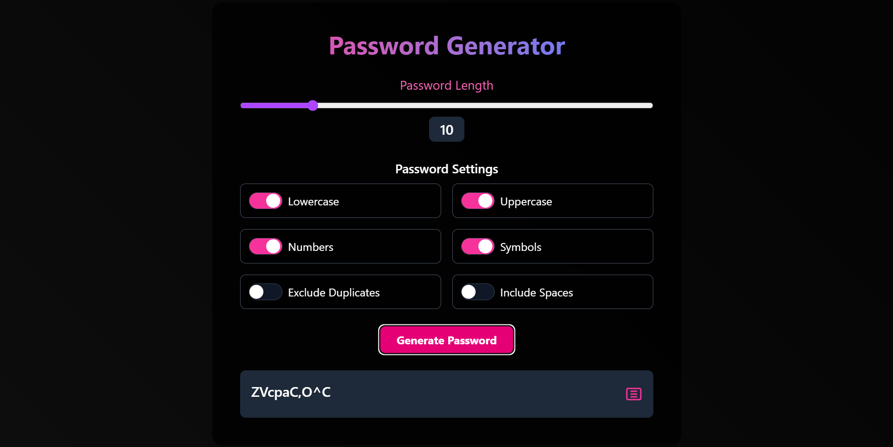

# 🛡️ Password Generator  

Built with React, TypeScript, and Tailwind CSS. This tool lets users create secure, customizable passwords with a smooth UI and transitions.<br>



---

## 🚀 Features
✅ Customizable Passwords – Select lowercase, uppercase, numbers, symbols, and spaces.  <br>
✅ Duplicate Prevention – Toggle to exclude repeating characters.  <br>
✅ Length Control – Adjust password length dynamically.  <br>
✅ Copy to Clipboard – One-click SVG button to copy the generated password.  <br>

## 📦 Installation & Usage
1️⃣ Clone the repo:  <br>
```sh
git clone https://github.com/your-username/password-generator.git
cd password-generator
```
2️⃣ Install dependencies:  <br>
```sh
npm install
```
3️⃣ Run the app:  <br>
```sh
npm run dev
```
4️⃣ Open in browser:  <br>
```
http://localhost:5173
```
